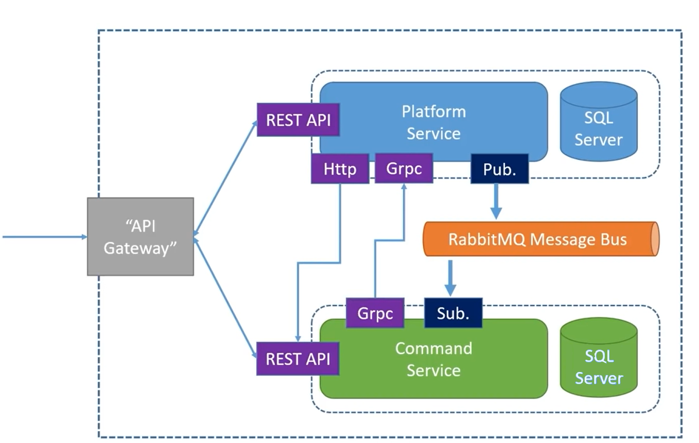
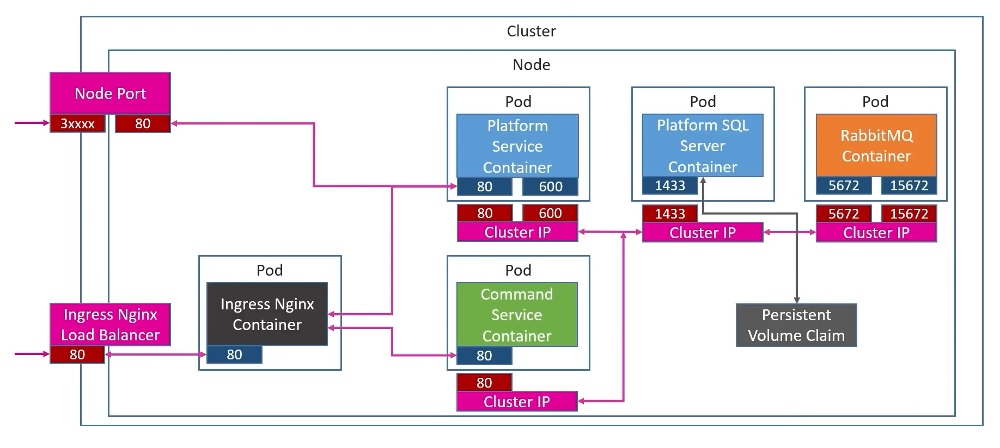
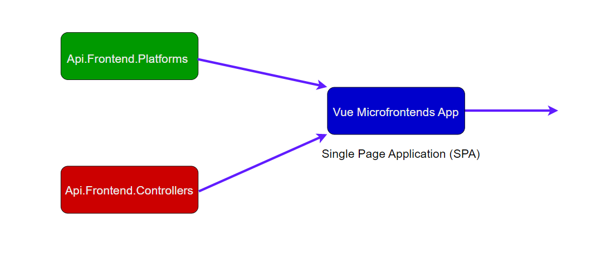
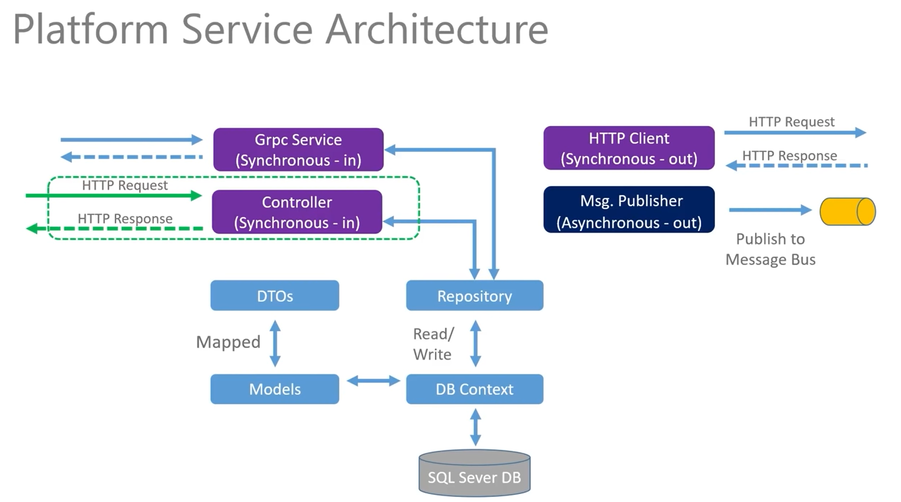
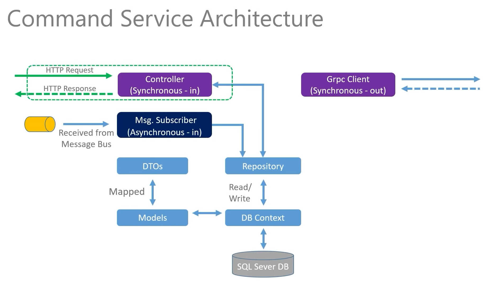

# SOA Application
# CRUD Application using .NET microservices and Vuejs microfrontend components
# Deployed into Kubernetes

# Diagrams
## 1. Full Architecture

## 2. Kubernetes Architecture

## 3. SPA - Frontend Service Architecture

## 4. Platform Service Architecture

## 5. Commands Service Architecture

# Description
The application is based on microservices created in .NET that communicates through the RabbitMQ message bus.

At the frontend level, a micro frontend-based architecture is applied, using Vuejs components.

The system allows the management of Platforms (viewing, creating, deleting) and Commands (viewing, creating, deleting).
These operations are grouped into two existing micro frontends: **Api.Frontend.Platforms**, which allows you to view, update delete a Platform, and **Api.Frontend.Commands**, where you can insert, update or delete a new Command for a Platform into the system.

The two models are:\
**Platform**: Id (unique), Name, Publisher, Cost. \
**Command**: Id (unique), CommandLine, HowTo, PlatformId.

There are 3 types of events that can be added on the RabbitMQ message bus: \
*PlatformPublished* \
*PlatformUpdated* \
*PlatformDeleted*

When creating a new platform, a POST request is sent to microservice 1 - *PlatformService*, which creates a new entity in the SQL database. After creation, an event **PlatformPublished** event is put on the message
bus. Then, the microservice 2 - *CommandsService*, consumes the message and creates a similar entity in the related database, created with Entity Framework.

In order to deploy the approach solution, we are using **docker images** that are constructing a Kubernetes cluster, which contain the entire solution. \
For every component, we have a .yaml file, that is applied to the cluster, constructing the containers in order to build the microservices and microfrontends and allowing us access them on different ports through the API Gateway.

## Service oriented architecture patterns
1. Microservices Pattern - decoupled applications
2. Publish/subscribe - using RabbitMQ message bus
3. Available REST Api, GRPC via .NET Controllers
4. Database/Shared Data Pattern - integration and syncronization between the two different databases; syncronisation is done using GRPC.
5. Loose coupling between consumers and services, and between the services themselves.
6. Run-time environment autonomy - modules are separately deployed and run in docker.

## Microservices
- **PlatformsService** 
    - .NET microservice that manages CRUD operations on the Platform entity; 
    - Has a database created with EntityFramework.
- **CommandsService**
    - .NET microservice that manages CRUD operations on Command entity; 
    - Has a database created with EntityFramework.
    - Containes definition for **RabbitMQ** service listener.
    
## Microfrontends
- **Api.Frontend.Platforms** 
    - Consumes REST services exposed by the controller of the client's PlatformService microservice.
    - Contains the component for creating a new Platform.
- **Api.Frontend.Commands** 
    - Consumes REST services exposed by the controller of the client's CommandsService microservice.
- **vue-microfrontends-app**
    - centralizes all the microfrontends (the main microfrontend) (only the definition)

## Technologies:
- Microservices: .NET,  GRPC, Ingress Nginx, RabbitMQ message bus
- Microfrontends: Vuejs
- Databases: EntityFramework, SSMS - SQL

# Create Kubernetes cluster
- For Microservices go to --> **K8S** and run all of the .yaml files 
    - Command: kubectl apply -f [yaml file for deployment-name]

    - PlatformService: platforms-deployment.yaml and platforms-nodeport-service.yaml
    - CommandsService: commands-deployment.yaml
    - Database: local-pvc.yaml and mssql-plat-depl.yaml
    - RabbitMQ: rabbitmq-deployment.yaml
    - Ingress Nginx: ingress-srv.yaml

- Lastly, the docker images for PlatformService and CommandsService:
    - Command:  
        kubectl build -t [dockerUsername]/microservice . \
        kubectl push [dockerUsername]/microservice

- For Microfrontends go to --> **vue-microfrontends-app** and run: **npm start** \
    - Api.Frontend.Platforms and Api.Frontend.Commands also need to be running: npm dev serve
    

## Access application via Browser or Insomnia
- For microservices:
    - Create the Kubernetes cluster before
    - Open Insomnia and try: (GET) soa-project.com/api/platforms / soa-project.com/api/c/platforms
    - for soa-project.com to work you need to add \
    *127.0.0.1 soa-project.com* \
    in the hosts Windows file

- For microfrontends:
    - open browser and access: localhost:8080, localhost:8081

